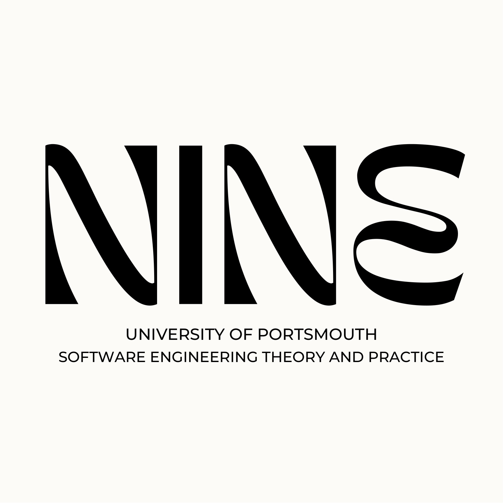

  

Welcome to the official GitHub organization for **SETAP TEAM NINE**, a committed group of students from the University of Portsmouth participating in the Software Engineering Theory and Practice (SETAP) course. Our collective mission is to apply our academic knowledge to real-world software engineering challenges and create innovative solutions through collaboration and cutting-edge technologies.

## Our Mission

Our mission is to create a comprehensive, user-friendly application that not only meets user needs but also serves as a testament to our collective skills in software design, implementation, and teamwork. We aim to produce a solution that is scalable, maintainable, and aligned with industry standards.

## Key Technologies

We employ a diverse set of technologies to ensure our project is built on a solid foundation. Our primary tools and technologies include:

**Frontend:** React
A powerful JavaScript library for building user interfaces, enabling us to create responsive and interactive web applications.

**Backend:** Java
A versatile and robust programming language that powers our server-side logic, ensuring performance and reliability.

**Database:** PostgreSQL
A powerful, open-source relational database management system, providing us with efficient data storage and retrieval capabilities.

**Version Control:** Git
Our choice for version control, facilitating seamless collaboration and continuous integration among team members.

## Projects

We are currently focused on our flagship project and we will update this space soon.

## Our Approach

Our approach to software development is guided by agile methodologies, allowing us to adapt to changes quickly and deliver incremental improvements. We emphasize:

**Collaboration:** Regular team meetings and code reviews to ensure quality and coherence.

**Innovation:** Encouraging creative solutions and the use of modern technologies.

**Quality:** Implementing best practices in coding, testing, and documentation to deliver a high-quality product.

## Contact Us

For collaboration, inquiries, or more information about our projects, feel free to reach out to us:

**Discord:** [UOP-BSC-SE-DS-CS](https://discord.gg/4kA4UFTr)

Thank you for visiting our GitHub organization!

